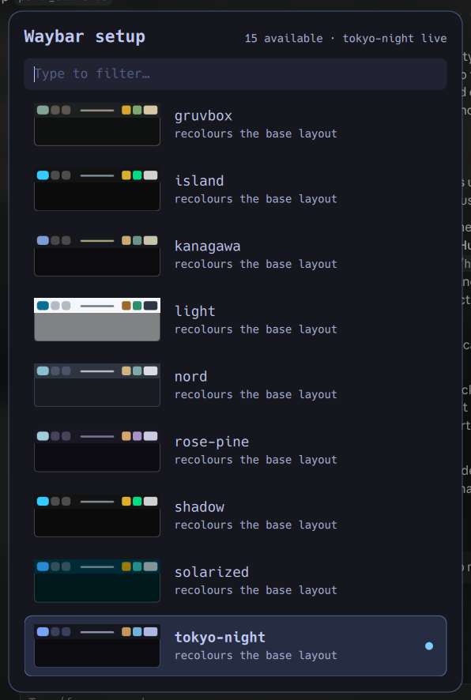

# hyprland_setup

A GUI for Hyprland setup, implemented in [quickshell](https://quickshell.outfoxxed.me/).

Two pages, switched with `Tab`: which waybar setup is live, and which terminal emulator
Hyprland opens.



## What a "setup" is

A setup is a name, discovered from `~/.config/waybar` rather than listed anywhere:

| file | meaning |
| --- | --- |
| `style-<name>.css` | what makes the name exist — a recolour of the base bar |
| `config-<name>.jsonc` | optional; the setup also rearranges modules or moves the bar |
| `style.css` + `config.jsonc` | the setup called `default` |

Dropping a new `style-<name>.css` beside `style.css` is the whole of adding a setup. The
picker will list it on its next run, with a preview built from the colours that stylesheet
actually defines.

Each row previews the bar it would produce — the resolved palette, and the edge the config
puts it on, so `vertical` reads as a vertical bar before you read its name. The previews are
mockups rather than screenshots on purpose: a real screenshot would mean starting waybar
under that setup first, which is the decision you have not made yet.

Colours resolve the way GTK itself resolves `@define-color` — the setup's own stylesheet
first, then the `style.css` it `@import`s, then the shared `~/.config/theme/colors.css` — so
a swatch cannot claim a colour the bar does not render.

## Use

```bash
./bin/waybar-setup-gui
```

Running it again closes it, so it behaves as a toggle when bound to a key. In Hyprland:

```
bindd = $mainMod SHIFT, T, Waybar setup, exec, ~/Documents/GitHub/hyprland_setup/bin/waybar-setup-gui
```

`↑` `↓` move, `Tab` switches page, `Enter` applies, `Ctrl+I` toggles the island, `Esc`
cancels. Clicking a row applies it; clicking outside
cancels.

Typing ranks rather than merely filters, and knows the names are kebab-case, so `tn` finds
`tokyo-night`, `rp` finds `rose-pine`, and `n` puts `nord` above the longer names that also
contain one.

Applying writes the chosen name to `$XDG_STATE_HOME/waybar/theme` and restarts the bar, so
the choice survives a relogin.

## Terminals

The terminals page lists what this machine actually offers, discovered from XDG desktop
entries rather than a hardcoded list, so one installed later appears without editing
anything. Four rules keep it honest, and each excludes something real:

| rule | what it drops |
| --- | --- |
| `TerminalEmulator` must be in the `Categories` *key* | xfce's meta-launcher, which only mentions it in `Exec` |
| `NoDisplay=true` is skipped | GNOME's "Terminal Preferences" |
| only the `[Desktop Entry]` group is read | gnome-terminal's actions, which would appear as three terminals |
| `TryExec`, or `Exec`'s first word, must resolve | anything with a desktop entry but no binary |

Hyprland freezes `$terminal` at parse time, so the choice cannot live in `hyprland.conf`
and still change while the session runs. It goes to `$XDG_STATE_HOME/hypr/terminal`, and
`hypr/scripts/terminal.sh` reads it at every launch — the same shape `waybar-launch.sh`
uses for the theme, and for the same reason: writing into `~/.config/hypr` would dirty the
dotfiles repo on every switch.

```bash
./scripts/hypr-terminal list        # what is installed, as TSV
./scripts/hypr-terminal current     # what SUPER+Q will open
./scripts/hypr-terminal apply kitty
```

## Dynamic island

A pill under the bar that wakes up when something happens worth a glance — the volume
moved, the track changed — and goes quiet again a couple of seconds later. It reads the
same resolved palette the picker does, so it wears whatever the bar is wearing, and
re-reads it when the theme state file changes.

```bash
./bin/island toggle     # also start | stop | status
```

Or from the panel: the row at the bottom, or `Ctrl+I`.

It runs as its own quickshell config rather than inside the panel, because their lifetimes
are opposites — the panel is launched on a key, applies one thing and exits, while the
island has to outlive every switch. The panel starts and stops it; closing the panel
leaves it running.

Nothing starts it at login yet. Add one line if you want it always on:

```
exec-once = ~/Documents/GitHub/hyprland_setup/bin/island start
```

## Without the GUI

Everything the GUI knows comes from one script, which is usable on its own — and is the
thing to reach for when it is the GUI that is misbehaving:

```bash
./scripts/waybar-setup list       # every setup, with its resolved colours, as TSV
./scripts/waybar-setup current    # the setup that is live right now
./scripts/waybar-setup apply nord # switch, and restart the bar
```

`current` reads the running waybar's command line rather than the state file. The state file
records what the *next* login will start, and the two drift the moment waybar is started by
hand — trusting it would mark the wrong row as live.

## Layout

| path | |
| --- | --- |
| `shell.qml` | entry point; owns every process call and all CSS parsing |
| `Picker.qml` | the overlay window, filtering and keyboard handling |
| `SetupCard.qml` | one row of the waybar page |
| `TerminalCard.qml` | one row of the terminals page |
| `BarPreview.qml` | the miniature bar |
| `island.qml` | the island's entry point; sources, state and window |
| `IslandPill.qml` | the pill that morphs |
| `bin/island` | start / stop / toggle / status |
| `modules/common/Fuzzy.qml` | ranking for the filter |
| `modules/common/PickerState.qml` | the cache, as a `FileView` + `JsonAdapter` |
| `scripts/waybar-setup` | discovery, colour resolution, applying |
| `scripts/hypr-terminal` | terminal discovery and choice |
| `bin/waybar-setup-gui` | toggling launcher |

QML only ever sees resolved values; paths, processes and CSS stop at `shell.qml`.

Singletons live under `modules/` and are imported as `qs.modules.common` — quickshell
registers the config root as `qs`, so no `qmldir` is needed.

## Startup

The picker paints from a cache at `$XDG_STATE_HOME/hyprland-setup/picker.json` and starts a
live refresh at the same time, so rows are on screen at ~14ms rather than ~137ms and a
stylesheet added since the last run appears a frame later. What is cached is the helper's
raw stdout, so there is only one parsing path rather than a second one for JSON.

`waybar-setup list` reads each stylesheet in a single `awk` pass. Resolving ten tokens with
a `grep` apiece across three files for fifteen setups meant roughly 1350 process spawns and
a full second before the first row could be drawn.

## Requires

quickshell 0.3, Qt 6.5+ (for `Qt.alpha`), a wlroots compositor, and a waybar config laid out
as above. It hands the actual relaunch to `~/.config/hypr/scripts/waybar-launch.sh` when that
exists, so the launch has a single owner, and falls back to invoking waybar directly when it
does not.
